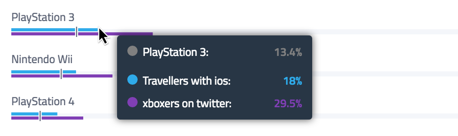

# d3scription

D3 tooltip description following mouse cursor. With window edge collision solved.



This plugin tries to be as universal and simple as possible.
You can install it using your favorite dependency manager - doesn't matter if it is [NPM](http://npmjs.org/) or [bower](https://bower.io/).
You can also **directly download distribution** if you do not use any of these. It supports many module systems (commonjs, AMD, TypeScript).
You can easily customize look in your css and overwrite all default values by providing your own.

# Instalation

## NPM

This will install npm package with **commonjs** module system:

```
npm install d3scription --save
```

## Bower

This will install bower package with **AMD** module and **global `d3scription` variable**:

```
bower install d3scription --save
```

## Direct download

If you do not want to use any dependency manager in your project you can simply download [distribution](dist/d3scription.js)
and place it in your project. This is exactly the same file as installed using bower. It supports **AMD modules or global `d3scription` function**.

```
curl https://raw.githubusercontent.com/GlobalWebIndex/d3scription/master/dist/d3scription.js > d3scription.js
```

# Usage
You can use this plugin with both **JavaScript and TypeScript**. Please see [demos](demo/) for some example usage.

## JavaScript

Assume you have d3scription.js file already loaded in browser together with d3.js or AMD manager is used you're able to use this plugin in similar fashion.
Don't forget, that this plugin itself is dependent on D3 so you need to include d3 before you load d3scription!

```js
// define some example data
var data = [
    {
        x: 50,
        y: 100,
        desc: 'We are your friends...'
    },
    {
        x: 200,
        y: 50,
        desc: 'I love it!'
    }
]

// select SVG element and create main group
var el = d3.select('svg')
    .append('g');

// setup plugin with description getter function and default options.
// if you want to overwrite default z-index, offset or class name please see `api:setup:options section`
var tipFactory = d3scription(function(d) { return d.desc; });

// create tip for our main group element
var tip = tipFactory()
    .element(el);

// set data to circles
var circles = el.selectAll('.circle')
    .data(data);

// draw circles
var cEnter = circles.enter()
    .append('circle')
    .attr('class', 'circle')
    .attr('r', 30)
    .attr('cx', function(d) { return d.x; })
    .attr('cy', function(d) { return d.y; })
    // setup show and hide action on mouse events
    .on('mouseover', tip.show)
    .on('mouseout', tip.hide);
```

## Typescript

Usage with typescript is quite simmilar as usage with any other module system.

```typescript
import d3scription from 'd3scription';

interface Data {
    x : number;
    y : number;
    desc : string;
}

// define some example data
const data : Data[] = [
    {
        x: 50,
        y: 100,
        desc: 'We are your friends...'
    },
    {
        x: 200,
        y: 50,
        desc: 'I love it!'
    }
]

// select SVG element and create main group
const el = d3.select('#first-example')
    .append('g');

// setup plugin with description getter function and default options.
// if you want to overwrite default z-index, offset or class name please see `api:setup:options section`
const tipFactory = d3scription((d : Data) => d.desc);

// create tip for our main group element
const tip = tipFactory()
    .element(el);

// set data to circles
const circles = el.selectAll('.circle')
    .data(data);

// draw circles
const cEnter = circles.enter()
    .append('circle')
    .attr('class', 'circle')
    .attr('r', 30)
    .attr('cx', d => d.x)
    .attr('cy', d => d.y)
    // setup show and hide action on mouse events
    .on('mouseover', tip.show)
    .on('mouseout', tip.hide);
```

# Styles

You can import or copy [default styles](css/style.css) to your project if you want.
Anyway as you can see writing your own styles for tooltip is really simple.

# API

Api is design as three steps process to make reuse and flow as clean as possible.
These steps are `setup` > `initialize` > `use`. Folloving paragraphs describes each step individually.

## Setup

First you need to setup new Tip factory (you can think about it as alternative to subclassing base class with necessary options even it's not really uses classes at all).
This is done using the only public function provided by d3scription out of the box - `de3scription([contentGetter], [optionalOptions])`.

This function accept two parameters - `contentGetter` and `options`.

**Content getter** is just regular function which takes `data` and returns `string` content of tip.
This works the same way as many d3 methods like `.attr('x', [getter])` or `.style('fill', [getter])`.

### Options

Are used for overwriting default settings of plugin. It's a **hash** where every key is optional.
For typescript plugin exports this interface under name `Options`.
There are all possible values:

* `zIndex` sets css z-index of tip element (default is 100).
* `class` set custom class name for element (default is `d3scription-tip`).
* `offset["top"]` top offset of tip (default is `-10`).
* `offset["left"]` left offset of tip (default is `10`).

You can create one settuped tipFactory and reuse it on multiple places or create as many of these factories as you wish.

### Example

```js
function getDescription(data) {
  return data.toolTipText;
}
var options = {
  zIndex: 1000,
  class: 'my-tooltip',
  offset: {
    top: 20,
    left: 20
  }
}
var myD3scription = d3Scription(getDescription, options);
var defaultD3scription = d3scription(getDescription);
```

## Factory

Settup function return another function which takes **element** in which tip should be active.
This is element in which tip will follow mouse. This function also creates final tip.
You can create many tips from one factory using this function.

### Example

```js
var element = d3.select('svg').append('g');
var tip = myD3scription().element(element); // this function was returned by setup
```

## Tip

Finally you'll have a tip instance returned by from factory (after passing element).
Now you can call methods on this tip as you wish. Most common case is to `show(data)` and `hide()`
on mouse events. you can also take advantage of `element(element)` for changing orginal element of tip
or using `destroy()`.

## Tip API

* `show(data)` sets content of tip and displays it.
* `hide()` hides tip
* `element(element)` sets new element for tip
* `destroy()` removes tip from dom

## Basic Example of usage

```js
// define circle elements and bind data for them
var circles = el.selectAll('.circle')
    .data(data);

// create circles and add tips actions to them
var cEnter = circles.enter()
    .append('circle')
    .attr('class', 'circle')
    .attr('r', 30)
    .attr('cx', function(d) { return d.x; })
    .attr('cy', function(d) { return d.y; })
    // show tip on mouseover
    // NOTE: will use binded data for setting content of tip
    .on('mouseover', tip.show)
    // hide tip on mouseout event
    .on('mouseout', tip.hide);
```
# Changelog

- v1.0.0 - improve API
- v0.0.2 - window edge collision detections
- v0.0.1 - initial release

# Building localy

All PRs are welcome! This is why we tried to made whole development setup as simple as possible.

Clone repository:

```
git clone git@github.com:GlobalWebIndex/d3scription.git
```

Install all dependecies via NPM and Bower:

```
npm install && bower install
```

The main file you want to work with is [index.ts](index.ts). There are also [demo examples](demo/) where you can play with plugin.

## Building project

There are few handy npm scripts already settuped up.

If you want to run project as watch run:

```
npm run watch
```

you can then open [demo/index.html](examples) in browser. Project will be compiled in background if you made any change to source.

For building distribution please run following.

```
npm run compile
```

This will compile all versions of plugin (including commonjs for usage with NPM).

# License

MIT

## About GlobalWebIndex


d3scription is maintained by GlobalWebIndex Ltd.

See more about us at [www.globalwebindex.net](https://www.globalwebindex.net).
